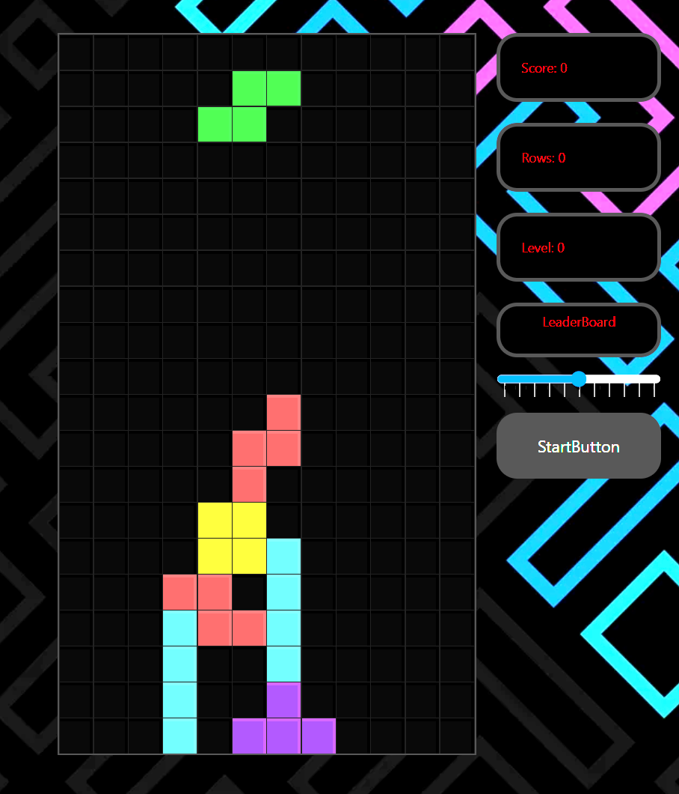
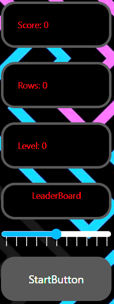
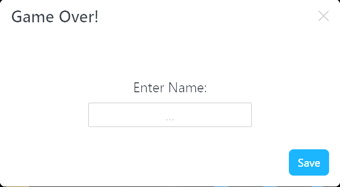

# Tetris

The aim for this project was to create a Tetris game. It has many types of blocks that will descend. To the right of the main play area there it a board that displays the users score, the number of rows completed, the current level, the leader board showing the top scores, a speed slider to increase or decrease the speed of the game and a Start button. The leader board data is persisted with IndexDB on the users machine. 
<br />


## Technologies
* React 18.2.0
* bootstrap 5.2.0
* idb-keyval 6.2.0

<br />
<br />
## Installation
First, run the development server:

```bash
npm run dev
# or
yarn dev
```

Open [http://localhost:3000](http://localhost:3000) with your browser to see the result.

The page will reload when you make changes.\
You may also see any lint errors in the console.
<br />
<br />

## Usage

To start a game click the start button and blocks will start to fall. You use the arrow keys to move the blocks left and right, up arrow key to rotate the block and the down arrow key to drop the block. The user can also change the speed of the falling blocks with the slider.
<br />

<br />
<br />
On game over a pop up block will appear that will allow you to enter a name so you can be added to the leader board
<br />



